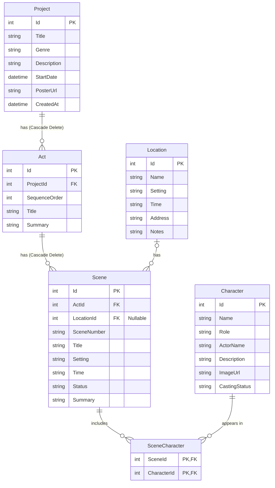

# Database Diagram

Dưới đây là sơ đồ cơ sở dữ liệu (Entity-Relationship Diagram) của hệ thống **CineX_API**, được biểu diễn bằng Mermaid:

```mermaid
erDiagram
    Project {
        int Id PK
        string Title
        string Genre
        string Description
        datetime StartDate
        string PosterUrl
        datetime CreatedAt
    }
    Act {
        int Id PK
        int ProjectId FK
        int SequenceOrder
        string Title
        string Summary
    }
    Scene {
        int Id PK
        int ActId FK
        int LocationId FK "Nullable"
        string SceneNumber
        string Title
        string Setting
        string Time
        string Status
        string Summary
    }
    Location {
        int Id PK
        string Name
        string Setting
        string Time
        string Address
        string Notes
    }
    Character {
        int Id PK
        string Name
        string Role
        string ActorName
        string Description
        string ImageUrl
        string CastingStatus
    }
    SceneCharacter {
        int SceneId PK,FK
        int CharacterId PK,FK
    }

    Project ||--o{ Act : "has (Cascade Delete)"
    Act ||--o{ Scene : "has (Cascade Delete)"
    Location |o--o{ Scene : "has"
    Scene ||--o{ SceneCharacter : "includes"
    Character ||--o{ SceneCharacter : "appears in"
```
